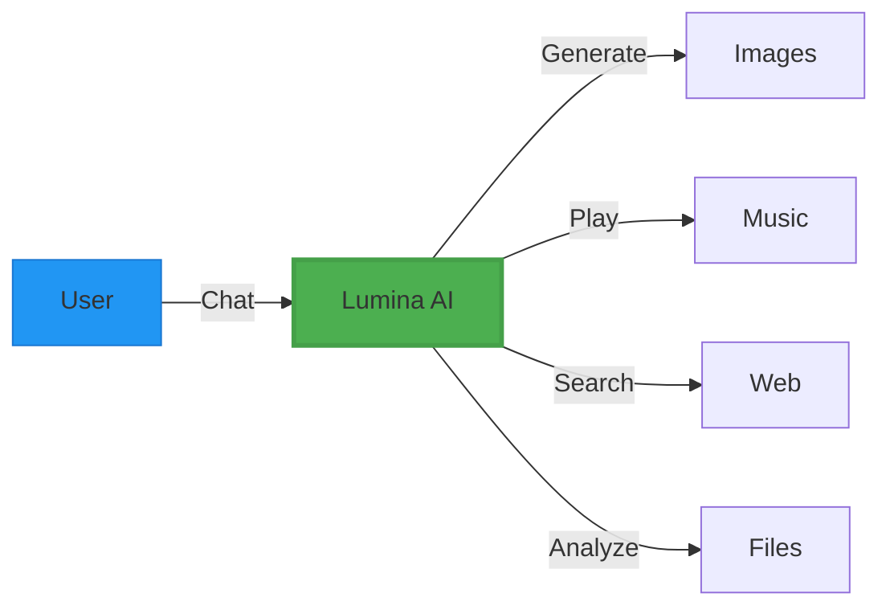
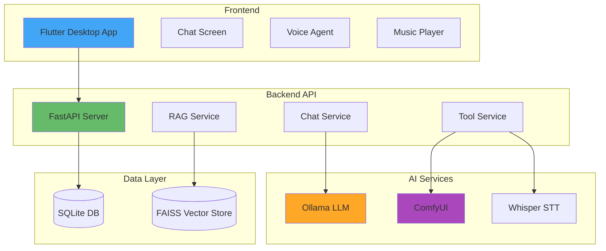

<div align="center">

# 🌟 Lumina AI

**Your Personal AI Assistant with Voice, Chat & Creative Tools**

[](https://flutter.dev)
[](https://www.python.org)
[](https://fastapi.tiangolo.com)
[](LICENSE)

[Features](#-features) • [Demo](#-demo) • [Installation](#-installation) • [Tech Stack](#-tech-stack) • [Architecture](#-architecture)

</div>

---

## ✨ Features

### 🎯 Core Capabilities

- **💬 Intelligent Chat** - Powered by local LLM (Ollama) with RAG support
- **🎨 AI Image Generation** - ComfyUI integration for stunning visuals
- **🎵 Music Player** - YouTube Music integration with smart recommendations
- **🗣️ Voice Agent** - Natural voice conversations with TTS/STT
- **📝 AI Subtitle** - Auto-generate subtitles for videos
- **🔍 Web Search** - Real-time web search in conversations
- **📄 File Chat** - Chat with your documents (PDF, TXT, DOCX)

### 🚀 Advanced Features

- **⚡ Auto-Update** - Seamless updates via GitHub Releases
- **🎭 Multi-Modal** - Text, voice, images, and files
- **🌓 Dark/Light Theme** - Beautiful UI with theme switching
- **💾 Conversation History** - Full chat history with search
- **🎯 Context-Aware** - RAG-powered responses using your data
- **🔒 Secure** - JWT authentication & encrypted storage

---

## 🎬 Demo

### Desktop App (Linux & Windows)

<div align="center">

|           Chat Interface           |             Voice Agent              |             Music Player             |
| :--------------------------------: | :----------------------------------: | :----------------------------------: |
|  |  |  |

</div>

### Key Features in Action



---

## 🛠️ Tech Stack

### Frontend (Flutter)

```yaml
Framework: Flutter 3.10+
Platforms: Windows, Linux, macOS (coming soon)
State Management: Provider
Key Libraries:
  - flutter_markdown: Rich text rendering
  - audioplayers: Voice & music playback
  - http: API communication
  - media_kit: Advanced media handling
```

### Backend (Python)

```python
Framework: FastAPI
LLM: Ollama (Llama 3.3, Qwen2.5)
Image Gen: ComfyUI with Flux models
Database: SQLite + FAISS vector store
Key Libraries:
  - langchain: LLM orchestration
  - chromadb: Vector embeddings
  - yt-dlp: YouTube music extraction
  - whisper: Speech-to-text
```

---

## 📦 Installation

### Prerequisites

- **Python 3.12+**
- **Flutter 3.10+**
- **Ollama** (for LLM)
- **ComfyUI** (for image generation)
- **FFmpeg** (for media processing)

### Quick Start

#### 1️⃣ Clone Repository

```bash
git clone https://github.com/Chunn241529/FourTAgent.git
cd FourTAgent
```

#### 2️⃣ Backend Setup

```bash
# Create virtual environment
python -m venv venv
source venv/bin/activate  # Linux/Mac
# or
venv\Scripts\activate  # Windows

# Install dependencies
pip install -r requirements.txt

# Configure environment
cp .env.example .env
# Edit .env with your settings

# Start server
python -m app.main
```

**Server will run on:** `http://localhost:8000`

#### 3️⃣ Flutter App Setup

```bash
cd mobile_app

# Install dependencies
flutter pub get

# Run on desktop
flutter run -d linux     # Linux
flutter run -d windows   # Windows
flutter run -d macos     # macOS
```

### Optional Services

#### Install Ollama

```bash
# Linux
curl -fsSL https://ollama.com/install.sh | sh

# Pull models
ollama pull llama3.3
ollama pull qwen2.5-coder
```

#### Setup ComfyUI

```bash
git clone https://github.com/comfyanonymous/ComfyUI.git
cd ComfyUI
pip install -r requirements.txt
python main.py --listen 127.0.0.1 --port 8188
```

---

## 🏗️ Architecture

### System Overview



### Data Flow

1. **User Input** → Flutter App
2. **API Request** → FastAPI Backend
3. **Tool Detection** → LLM decides which tools to use
4. **Tool Execution** → Image gen, search, music, etc.
5. **Response** → Stream back to user

---

## 🎨 Key Features Explained

### 🤖 Intelligent Chat with RAG

Upload documents and chat with them! Lumina uses FAISS vector store to find relevant context from your files.

```python
# Example: Chat with a PDF
User: "Summarize the key points from my document"
Lumina: *retrieves relevant chunks* → *generates summary*
```

### 🎨 AI Image Generation

Powered by ComfyUI with Flux models. Just describe what you want:

```
User: "Create an image of a futuristic city with flying cars"
Lumina: *generates stunning image* 🖼️
```

### 🎵 Music Intelligence

Search and play music from YouTube with smart recommendations:

```
User: "Play some chill lo-fi music"
Lumina: *searches* → *plays playlist* 🎶
```

### 🗣️ Voice Conversations

Natural voice interactions with voice activity detection:

- **Wake word detection**
- **Conversational responses**
- **Voice fillers** for natural flow

---

## 📖 API Documentation

Once the server is running, visit:

- **Interactive API Docs:** `http://localhost:8000/docs`
- **Alternative Docs:** `http://localhost:8000/redoc`

### Key Endpoints

```http
POST /api/chat/stream          # Streaming chat responses
POST /api/generate/image       # Generate images
GET  /api/updates/version      # Check for updates
POST /conversations            # Create conversation
GET  /conversations/{id}       # Get conversation history
```

---

## 🔧 Configuration

### Environment Variables

```bash
# LLM API (Ollama)
OLLAMA_API_KEY=your_api_key

# Image Generation
COMFYUI_HOST=http://127.0.0.1:8188
COMFYUI_OUTPUT_DIR=/path/to/ComfyUI/output

# Cloud Fallback (Groq)
ENABLE_CLOUD_FALLBACK=true
GROQ_API_KEY=your_groq_key
GROQ_MODEL=llama-3.3-70b-versatile

# GitHub Auto-Update
GITHUB_OWNER=Chunn241529
GITHUB_REPO=FourTAgent

# Database
SQLALCHEMY_DATABASE_URL=sqlite:///./server.db

# Security
SECRET_KEY=your-secret-key-here

# SMTP (for password reset)
SMTP_SERVER=smtp.gmail.com
SMTP_PORT=587
SMTP_USER=your_email@gmail.com
SMTP_PASS=your_app_password
```

---

## 🚀 Deployment

### Desktop Build

#### Windows

```bash
cd mobile_app
flutter build windows --release
# Output: build/windows/x64/runner/Release/
```

#### Linux

```bash
flutter build linux --release
# Output: build/linux/x64/release/bundle/
```

### Server Deployment

```bash
# Using uvicorn
uvicorn app.main:app --host 0.0.0.0 --port 8000

# Or with Docker (coming soon)
docker-compose up -d
```

---

## 🧪 Testing

```bash
# Backend tests
pytest test/

# Flutter tests
cd mobile_app
flutter test

# Integration tests
flutter integration_test
```

---

## 🤝 Contributing

Contributions are welcome! Please follow these steps:

1. Fork the repository
2. Create a feature branch (`git checkout -b feature/AmazingFeature`)
3. Commit changes (`git commit -m 'Add some AmazingFeature'`)
4. Push to branch (`git push origin feature/AmazingFeature`)
5. Open a Pull Request

### Development Guidelines

- **Code Style:** Follow PEP 8 (Python) and Dart style guide
- **Commits:** Use conventional commits
- **Documentation:** Update README for new features
- **Tests:** Add tests for new functionality

---

## 📝 Changelog

### v1.0.2 (Latest)

- ✨ Added auto-update module
- 🎨 Enhanced image viewer with download
- 🎵 Improved music auto-play
- 🐛 Fixed conversation title generation

### v1.0.1

- 🚀 Initial stable release
- 💬 Chat with RAG support
- 🎨 Image generation
- 🎵 Music player
- 🗣️ Voice agent

[View Full Changelog](CHANGELOG.md)

---

## 📄 License

This project is licensed under the MIT License - see the [LICENSE](LICENSE) file for details.

---

## 🙏 Acknowledgments

- **Ollama** - Local LLM inference
- **ComfyUI** - Image generation
- **Flutter** - Beautiful cross-platform UI
- **FastAPI** - High-performance API framework
- **LangChain** - LLM orchestration
- Open source community ❤️

---

## 📞 Contact & Support

- **Author:** Chunn241529
- **GitHub:** [@Chunn241529](https://github.com/Chunn241529)
- **Issues:** [GitHub Issues](https://github.com/Chunn241529/FourTAgent/issues)

---

<div align="center">

### ⭐ Star us on GitHub — it motivates us a lot!

Made with ❤️ by Chunn241529

</div>
