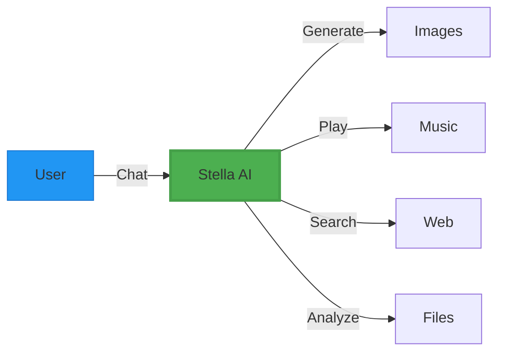
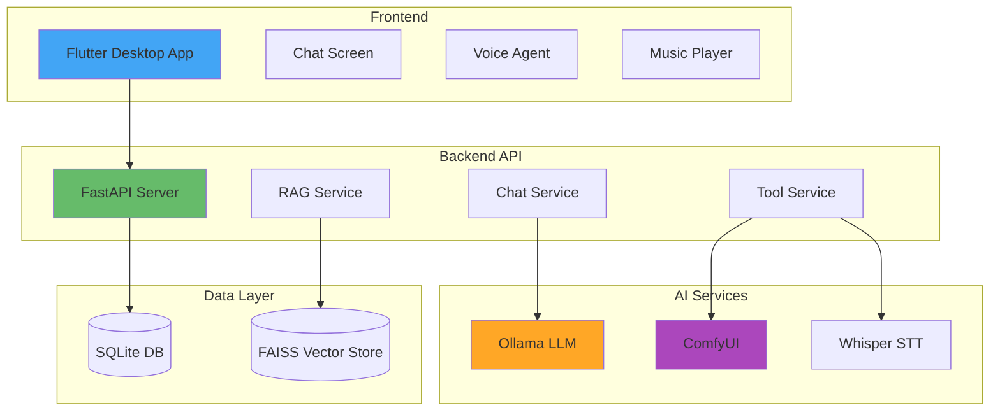

<div align="center">

# 🌟 Stella AI

**Your Personal AI Assistant with Voice, Chat & Creative Tools**

[](https://flutter.dev)
[](LICENSE)

[Features](#-features) • [Demo](#-demo) • [Installation](#-installation) • [Tech Stack](#-tech-stack) • [Architecture](#-architecture)

</div>

---

## ✨ Features

### 🎯 Core Capabilities

- **💬 Intelligent Chat** - Powered by local LLM (Ollama) with RAG support
- **🎨 AI Creative Studio** - Professional Image Generation & Smart Editing (Flux 2)
- **🎵 AI Music Master** - Transform ideas into melodies with ACE-Step 1.5
- **🗣️ Voice Agent** - Natural voice conversations with TTS/STT
- **📝 AI Subtitle** - Auto-generate subtitles for videos
- **💻 Code Wizard** - Real-time Python execution for complex tasks
- **🔍 Web Search** - Real-time web search in conversations
- **📄 File Chat** - Chat with your documents (PDF, TXT, DOCX)

### 🚀 Advanced Features

- **⚡ Auto-Update** - Seamless updates via GitHub Releases
- **🎭 Multi-Modal** - Text, voice, images, and files
- **🌓 Dark/Light Theme** - Beautiful UI with theme switching
- **💾 Conversation History** - Full chat history with search
- **🎯 Context-Aware** - RAG-powered responses using your data
- **🔒 Secure** - JWT authentication & encrypted storage

---

## 🎬 Demo

### Desktop App (Linux & Windows)

<div align="center">

|           Chat Interface           |             Voice Agent              |             Music Player             |
| :--------------------------------: | :----------------------------------: | :----------------------------------: |
|  |  |  |

</div>

### Key Features in Action


```mermaid
graph LR
    A[User] -->|Chat| B[Stella AI]
    B -->|Generate| C[Images]
    B -->|Play| D[Music]
    B -->|Search| E[Web]
    B -->|Analyze| F[Files]
    style B fill:#4CAF50,stroke:#45a049,stroke-width:3px
    style A fill:#2196F3,stroke:#1976D2
```

---

## 🛠️ Tech Stack

### Frontend (Flutter)

```yaml
Framework: Flutter 3.10+
Platforms: Windows, Linux, macOS (coming soon)
State Management: Provider
Key Libraries:
  - flutter_markdown: Rich text rendering
  - audioplayers: Voice & music playback
  - http: API communication
  - media_kit: Advanced media handling
```

---

## 📦 Installation

### Prerequisites

- **Flutter 3.10+**
- **FFmpeg** (for media processing)

### Quick Start

#### 1️⃣ Clone Repository

```bash
git clone https://github.com/Chunn241529/FourTAgent.git
cd FourTAgent
```

#### 2️⃣ Flutter App Setup

```bash
cd src

# Install dependencies
flutter pub get

# Run on desktop
flutter run -d linux     # Linux
flutter run -d windows   # Windows
flutter run -d macos     # macOS
```

---

## 🏗️ Architecture

### System Overview


```mermaid
graph TB
    subgraph "Frontend"
        A[Flutter Desktop App]
        A1[Chat Screen]
        A2[Voice Agent]
        A3[Music Player]
    end

    subgraph "Backend API"
        B[FastAPI Server]
        B1[Chat Service]
        B2[Tool Service]
        B3[RAG Service]
    end

    subgraph "AI Services"
        C[Ollama LLM]
        D[ComfyUI]
        E[Whisper STT]
    end

    subgraph "Data Layer"
        F[(SQLite DB)]
        G[(FAISS Vector Store)]
    end

    A --> B
    B1 --> C
    B2 --> D
    B2 --> E
    B3 --> G
    B --> F

    style A fill:#42A5F5
    style B fill:#66BB6A
    style C fill:#FFA726
    style D fill:#AB47BC
```

### Data Flow

1. **User Input** → Flutter App
2. **API Request** → FastAPI Backend
3. **Tool Detection** → LLM decides which tools to use
4. **Tool Execution** → Image gen, search, music, etc.
5. **Response** → Stream back to user

---

## 🎨 Key Features Explained

### 🤖 Intelligent Chat with RAG

Upload documents and chat with them! Stella uses FAISS vector store to find relevant context from your files.

```python
# Example: Chat with a PDF
User: "Summarize the key points from my document"
Stella: *retrieves relevant chunks* → *generates summary*
```

### 🎨 AI Creative Studio (Generation & Editing)

Sáng tạo không giới hạn với bộ công cụ hình ảnh đỉnh cao:
- **Nghệ thuật từ văn bản**: Biến ý tưởng thành hình ảnh siêu thực với mô hình **Flux 2** mạnh mẽ nhất hiện nay.
- **Phép màu chỉnh sửa (Inpainting)**: Xóa vật thể, thay đổi trang phục, hoặc tùy biến mọi chi tiết trong ảnh chỉ bằng lời nói.
- **Mở rộng khung hình (Outpainting)**: Để Stella vẽ tiếp những phần còn thiếu của bức ảnh theo trí tưởng tượng của bạn.

```
User: "Chuyển bức ảnh này sang phong cách Cyberpunk và thêm ánh đèn neon rực rỡ"
Stella: *đang xử lý nghệ thuật* 🖌️✨
```

### 🎵 AI Music Master (ACE-Step 1.5)

Stella mang cả phòng thu chuyên nghiệp đến cho bạn:
- **Sáng tác thần tốc**: Tạo ra các bản nhạc hoàn chỉnh từ Prompt hoặc lời bài hát với công nghệ **ACE-Step 1.5**.
- **Biến hóa âm nhạc (Cover/Remix)**: Đổi giọng ca sĩ hoặc làm mới phong cách cho bất kỳ bài hát nào bạn yêu thích.
- **Chỉnh sửa âm thanh (Repaint)**: Sửa lại từng đoạn nhạc hoặc thay đổi nhạc cụ trong một bản phối có sẵn.

```
User: "Viết một bản Lo-fi buồn về những cơn mưa chiều Hà Nội, tiết tấu chậm"
Stella: *đang sáng tạo giai điệu* 🎶🎹
```

### 💻 Code Wizard (Python Interpreter)

Giải quyết mọi bài toán phức tạp ngay trong cửa sổ chat:
- **Thực thi mã nguồn**: Chạy Python trực tiếp để tính toán số liệu, vẽ biểu đồ hoặc xử lý dữ liệu lớn.
- **Độ chính xác tuyệt đối**: Không còn nỗi lo LLM tính sai, Stella sẽ lập trình để đưa ra kết quả chuẩn xác nhất.

```
User: "Vẽ biểu đồ so sánh doanh thu các quý năm 2024 từ file Excel này"
Stella: *đang lập trình và xuất biểu đồ* 📊🐍
```

### 🗣️ Voice Conversations

Natural voice interactions with voice activity detection:

- **Wake word detection**
- **Conversational responses**
- **Voice fillers** for natural flow

---

## 🚀 Deployment

### Desktop Build

#### Windows

```bash
cd src
flutter build windows --release
# Output: build/windows/x64/runner/Release/
```

#### Linux

```bash
flutter build linux --release
# Output: build/linux/x64/release/bundle/
```

---

## 🧪 Testing

```bash
# Flutter tests
cd src
flutter test

# Integration tests
flutter integration_test
```

---

## 🤝 Contributing

Contributions are welcome! Please follow these steps:

1. Fork the repository
2. Create a feature branch (`git checkout -b feature/AmazingFeature`)
3. Commit changes (`git commit -m 'Add some AmazingFeature'`)
4. Push to branch (`git push origin feature/AmazingFeature`)
5. Open a Pull Request

### Development Guidelines

- **Code Style:** Follow the Dart style guide
- **Commits:** Use conventional commits
- **Documentation:** Update README for new features
- **Tests:** Add tests for new functionality

---

## 📝 Changelog

### v1.0.2 (Latest)

- ✨ Added auto-update module
- 🎨 Enhanced image viewer with download
- 🎵 Improved music auto-play
- 🐛 Fixed conversation title generation

### v1.0.1

- 🚀 Initial stable release
- 💬 Chat with RAG support
- 🎨 Image generation
- 🎵 Music player
- 🗣️ Voice agent

[View Full Changelog](CHANGELOG.md)

---

## 📄 License

This project is licensed under the MIT License - see the [LICENSE](LICENSE) file for details.

---

## 🙏 Acknowledgments

- **Ollama** - Local LLM inference
- **ComfyUI** - Image generation
- **Flutter** - Beautiful cross-platform UI
- **FastAPI** - High-performance API framework
- **LangChain** - LLM orchestration
- Open source community ❤️

---

## 📞 Contact & Support

- **Author:** Chunn241529
- **GitHub:** [@Chunn241529](https://github.com/Chunn241529)
- **Issues:** [GitHub Issues](https://github.com/Chunn241529/FourTAgent/issues)

---

<div align="center">

### ⭐ Star us on GitHub — it motivates us a lot!

Made with ❤️ by Chunn241529

</div>
